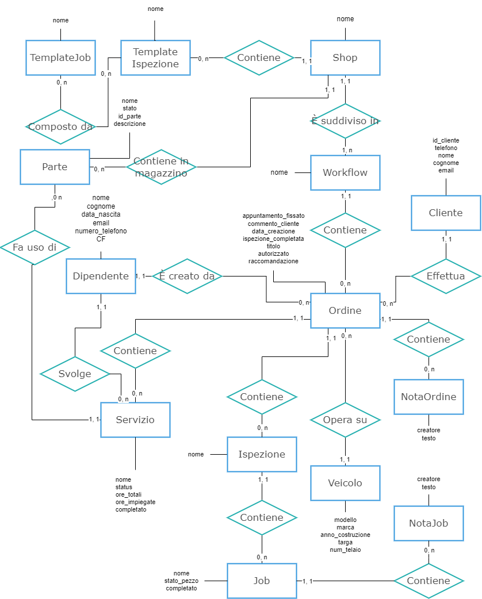

# Officina
Gestionale per autofficine, gestione riparazioni (clone di Shopmonkey)

## Target del software
Autofficine di piccole / medie dimensioni che si occupano esclusivamente di autoriparazioni e/o servizio gommista, con uno o più dipendenti, con o senza rifornitori ufficiali

## Problemi che il software si pone l'obiettivo di risolvere
- Passare da salvare gli ordini di riparazione su carta a salvarli in digitale, in modo da archiviarli, ordinarli e modificarli digitalmente
- Ottenere bilanci automatici sui guadagni di un dato periodo
- Osservare la produttività dei singoli impiegati e dell'autofficina
- Trovare ricambi al minor prezzo disponibile online
- Gestire il magazzino dei ricambi

## Lista funzionalità
- Creare un ordine (data, cliente, descrizione problema, stima iniziale)
- Modifcare un ordine
- Ottenere uno storico di ordini per cliente
- Ottenere uno storico di ordini per veicolo
- Gestire il magazzino (aggiungere / rimuovere pezzi) e cercare online il prezzo per un pezzo

## Diagramma E/R

### Considerazioni aggiuntive:
- Ogni `Cliente` può essere associato anche a 0 `Ordine` (ad esempio nel caso in cui è appena stato creato)
- Ogni `Ispezione` può essere associato anche 0 `Job` (ad esempio caso in cui è appena stata creata)
- Ogni `TemplateIspezione` può essere associato anche 0 `Job` (ad esempio caso in cui è stata appena creata)
- Ogni `TemplateJob` può essere associato a 0 o più `TemplateIspezione` (0 ad esempio nel caso in cui è stato appena creato, più ad esempio nel caso in cui due ispezioni hanno entrambe "ispezione freni")
- Ogni `Servizio` può essere associato anche a 0 `Parte` (ad esempio nel caso in cui il servizio sia una semplice calibrazione, come gonfiaggio gomme o calibrazione convergenza / campanatura ruote)

## FAQ
Q: Perchè non è prevista una gestione più accurata del magazzino, con ad esempio l'acquisto di pezzi, la loro posizione nel magazino, valore dei pezzi eccetera? E la funzionalità che permette ai dipendenti di timbrare all'entrata e all'uscita della giornata lavorativa?

A: Questa funzione non è prevista a causa dell'elevata complessità che introdurrebbe all'interno del progetto.