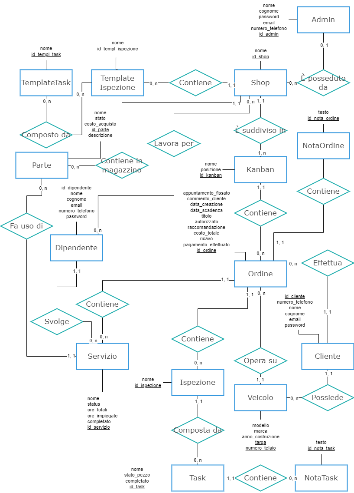

# Q&S Repairs
Gestionale per autofficine, gestione ordini riparazioni (clone di Shopmonkey)

## Target del software
Autofficine di piccole / medie dimensioni che si occupano esclusivamente di autoriparazioni e/o servizio gommista, con una o più sedi, ciascuna con uno o più dipendenti

## Problemi che il software si pone l'obiettivo di risolvere
- Passare da salvare gli ordini di riparazione su carta a salvarli in digitale, in modo da archiviarli, ordinarli e modificarli digitalmente
- Avere accesso ad un elenco completo e aggiornabile delle sedi della propria officina
- Per ciascuna officina della propria compagnia, avere accesso ad elenchi completi ed aggiornabili per:
  - i propri clienti, gli ordini commissionati da ciascuno e il veicolo interessato dall'ordine
  - i dipendenti impiegati nell'officina
  - lo storico degli ordini svolti e di quelli attivi dell'officina
- Permettere ai clienti di visualizzare lo storico dei propri ordini e gli ordini attivi in maniera facile e veloce

## Lista funzionalità
Per praticità le funzionalità ***aggiungi / visualizza / aggiorna / rimuovi*** verranno riportate con la sigla ***CRUD***
- Cliente:
  - Visualizza lo storico degli ordini e quelli in corso con le relative informazioni (veicolo associato, commenti propri e dell'officina, appuntamenti...)
  - CRUD veicoli
  - Visualizza / aggiorna informazioni personali
- Dipendente:
  - CRUD ordini (dell'officina in cui è impiegato)
  - Visualizza / aggiorna informazioni personali
- Admin:
  - Tutti i privilegi di Dipendente
  - CRUD officine, ciascuna con i propri ordini, kanban e dipendenti
  - CRUD clienti, ciascuno con i propri veicoli

### Considerazioni aggiuntive sulle funzionalità:
- Gli account admin vengono creati dal gestore del software tramite un processo non automatizzato (e non automatizzabile), che prevede l'inserimento manuale all'interno del database dei dati dell'admin stesso: questa è una scelta di design atta a favorire la sicurezza del software, oltre a permetterne l'ideale gestione dei clienti.

## Diagramma E/R

### Considerazioni aggiuntive:
- `Ordine` non è direttamente collegato a `Shop` poichè lo `Shop` è ottenibile dal `Kanbak` a cui è assegnato
- Ogni `Cliente` può essere associato anche a 0 `Ordine` (ad esempio nel caso in cui è appena stato creato)
- Ogni `Cliente` può effettuare ordini con più `Shop`, per questo motivo non c'è alcuna relazione tra le due entità
- Ogni `Ispezione` può essere associato anche 0 `Task` (ad esempio caso in cui è appena stata creata)
- Ogni `TemplateIspezione` può essere associato anche 0 `Task` (ad esempio caso in cui è stata appena creata)
- Ogni `TemplateTask` può essere associato a 0 o più `TemplateIspezione` (0 ad esempio nel caso in cui è stato appena creato, più ad esempio nel caso in cui due ispezioni hanno entrambe "ispezione freni")
- Ogni `Servizio` può essere associato anche a 0 `Parte` (ad esempio nel caso in cui il servizio sia una semplice calibrazione, come gonfiaggio gomme o calibrazione convergenza / campanatura ruote)
- Ogni `Shop` può essere associato anche a 0 `Admin` (ad esempio nel caso in cui lo shop è stato appena creato, oppure si vuole cambiare admin dello shop)
- Ogni `Admin` può essere associato anche a 0 o più `Shop` (0 ad esempio nel caso in cui l'admin è stato appena creato o un altro admin ha preso in gestione la sua officina, più nel caso in cui gestisca più officine)
- Ogni `Dipendente` può essere associato anche a 0 o più `Shop` (ad esempio nel caso in cui sia stato appena creato, o appena licenziato, più nel caso in cui lavori per più officine)

## Schema relazionale
**TemplateTask**(nome, **id_templ_task**)

**Admin**(nome, cognome, password, email, numero_telefono, **id_admin**)

**Shop**(nome, **id_shop**, **Admin_id_admin**)

**TemplateIspezione**(nome, **Shop_id_shop**, **id_templ_ispezione**)

**TemplateTask_TemplateIspezione**(**TemplateIspezione_id_templ_ispezione**, **TemplateTask_id_templ_task**)

**Kanban**(nome, posizione, **id_kanban**, **Shop_id_shop**)

**Cliente**(telefono, nome, cognome, email, password, **id_cliente**)

**Veicolo**(modello, marca, anno_costruzione, **targa**, **num_telaio**, **Cliente_id_cliente**)

**Dipendente**(nome, cognome, email, numero_telefono, password, **id_dipendente**, **Shop_id_shop**);

**Ordine**(appuntamento_fissato, commento_cliente, data_creazione, data_scadenza, titolo, autorizzato, raccomandazione, pagamento_effettuato, ricavo, costo_totale, **id_ordine**, **Kanban_id_kanban**, **Cliente_id_cliente**, **Veicolo_targa**, **Veicolo_num_telaio**)

**NotaOrdine**(testo, **id_nota_ordine**, **Ordine_id_ordine**)

**Ispezione**(nome, **id_ispezione**, **Ordine_id_ordine**)

**Task**(nome, stato_pezzo, completato, **Task_id_task**, **Ispezione_id_ispezione**)

**NotaTask**(testo, **id_nota_task**, **Task_id_task**)

**Servizio**(nome, status, ore_stimate, ore_impiegate, completato, **id_servizio**, **Ordine_id_ordine**)

**Parte**(nome, stato, descrizione, costo_acquisto, **id_parte**, **Shop_id_shop**, **Servizio_id_servizio**)

## Come eseguire il programma
Clonare la repository sulla propria macchina, ed eseguire il comando `./mvnw spring-boot:run` (è richiesta la presenza di una JDK sulla propria macchina)

Come accedere ad H2 Console (per visualizzare / modificare il database): 
1. Modificare il metodo `SecurityFilterChain securityFilterChain(HttpSecurity http)` della classe `AdminSecurityConfig` seguendo questa guida: https://stackoverflow.com/a/75406079
2. Seguire la procedura descritta in questo articolo, inserendo nel campo `JDBC Url` il valore dell'attributo `spring.datasource.url` contenuto in `main/resources/application.properties`: https://www.baeldung.com/spring-boot-h2-database

## FAQ
Q: Perchè non è prevista una gestione più accurata del magazzino, con ad esempio l'acquisto di pezzi, la loro posizione nel magazino, valore dei pezzi eccetera? E la funzionalità che permette ai dipendenti di timbrare all'entrata e all'uscita della giornata lavorativa?

A: Queste, e molte altre funzioni, non sono previste a causa dell'elevata complessità che introdurrebbe all'interno del progetto.
