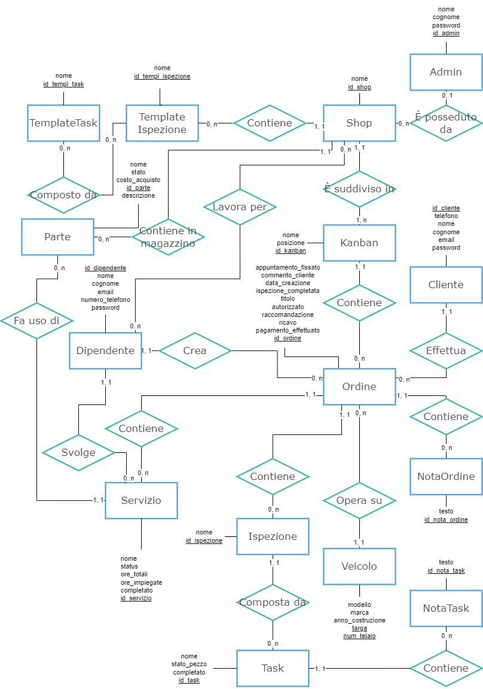

# Officina
Gestionale per autofficine, gestione ordini riparazioni (clone di Shopmonkey)

## Target del software
Autofficine di piccole / medie dimensioni che si occupano esclusivamente di autoriparazioni e/o servizio gommista, con uno o più dipendenti, con o senza rifornitori ufficiali

## Problemi che il software si pone l'obiettivo di risolvere
- Passare da salvare gli ordini di riparazione su carta a salvarli in digitale, in modo da archiviarli, ordinarli e modificarli digitalmente
- Ottenere bilanci automatici sui guadagni di un dato periodo (**attenzione, non sono contenute informazioni sui soldi da nessuna parte!!!**)
- Osservare la produttività dei singoli impiegati e dell'autofficina
- Gestire il magazzino dei ricambi
- **aggiungere tutti gli altri problemi che il software risolve**

## Lista funzionalità
- Creare un ordine (data, cliente, descrizione problema, stima iniziale)
- Modifcare un ordine
- Ottenere uno storico di ordini per cliente
- Ottenere uno storico di ordini per veicolo
- Gestire il magazzino (aggiungere / rimuovere pezzi) e cercare online il prezzo per un pezzo
- Privilegi associati ai singoli utenti:
  - Dipendente:
    - Aggiungi / visualizza / aggiorna / rimuovi parti dal magazzino; kanban; clienti; ordini con note, servizi, ispezioni, note e task delle singole ispezioni correlate ad essi; veicoli; _Template ispezione_; _Template task_
    - Visualizza lo storico delle officine in cui ha lavorato e degli ordini svolti in ciascuna officina
  - Admin:
    - Tutti i privilegi di Dipendente
    - Rinomina lo shop
    - Aggiungi / visualizza / aggiorna / rimuovi dipendenti dello shop
  - Cliente:
    - Visualizza lo storico degli ordini e quelli in corso con le relative informazioni (veicolo associato, commenti propri e dell'officina, appuntamenti...)
- **aggiungere altre funzionalità**

### Considerazioni aggiuntive sulle funzionalità:
- Il software offre la possibilità anche ai dipendenti, e non unicamente agli admin, di inserire numerosi dati anche sensibili e di estrema importanza (ad esempio i clienti) all'interno del database per una questione puramente produttiva, seppur vada a discapito della sicurezza: se ogni volta che il dipendente deve aggiungere al database un dato ha bisogno dell'intervento dell'admin, la produttività dell'officina scende e il software diventa d'intralcio più che di sostegno.
- Quando vengono aggiunti i dati al database vengono effettuati numerosi controlli come ad esempio la verifica della rilevanza dei dati o che non vengano aggiunti dei duplicati, in modo da rendere la base di dati il più uniforme possibile.
- Gli account admin vengono creati dal possessore del software tramite un processo non automatizzato, che prevede l'inserimento manuale all'interno del database dei dati dell'admin stesso: questa è una scelta di design atta a favorire la sicurezza del software (se il possessore del software avesse un account, e un malintenzionato dovesse entrare in possesso delle sue credenziali, il malintenzionato stesso avrebbe pieno controllo del software).

## Diagramma E/R

### Considerazioni aggiuntive:
- Ogni `Cliente` può essere associato anche a 0 `Ordine` (ad esempio nel caso in cui è appena stato creato)
- Ogni `Ispezione` può essere associato anche 0 `Task` (ad esempio caso in cui è appena stata creata)
- Ogni `TemplateIspezione` può essere associato anche 0 `Task` (ad esempio caso in cui è stata appena creata)
- Ogni `TemplateTask` può essere associato a 0 o più `TemplateIspezione` (0 ad esempio nel caso in cui è stato appena creato, più ad esempio nel caso in cui due ispezioni hanno entrambe "ispezione freni")
- Ogni `Servizio` può essere associato anche a 0 `Parte` (ad esempio nel caso in cui il servizio sia una semplice calibrazione, come gonfiaggio gomme o calibrazione convergenza / campanatura ruote)
- Ogni `Shop` può essere associato anche a 0 `Admin` (ad esempio nel caso in cui lo shop è stato appena creato, oppure si vuole cambiare admin dello shop)
- Ogni `Admin` può essere associato anche a 0 o più `Shop` (0 ad esempio nel caso in cui l'admin è stato appena creato o un altro admin ha preso in gestione la sua officina, più nel caso in cui gestisca più officine)
- Ogni `Dipendente` può essere associato anche a 0 o più `Shop` (ad esempio nel caso in cui sia stato appena creato, o appena licenziato, più nel caso in cui lavori per più officine)

## FAQ
Q: Perchè non è prevista una gestione più accurata del magazzino, con ad esempio l'acquisto di pezzi, la loro posizione nel magazino, valore dei pezzi eccetera? E la funzionalità che permette ai dipendenti di timbrare all'entrata e all'uscita della giornata lavorativa?

A: Queste funzioni non sono previste a causa dell'elevata complessità che introdurrebbe all'interno del progetto.
